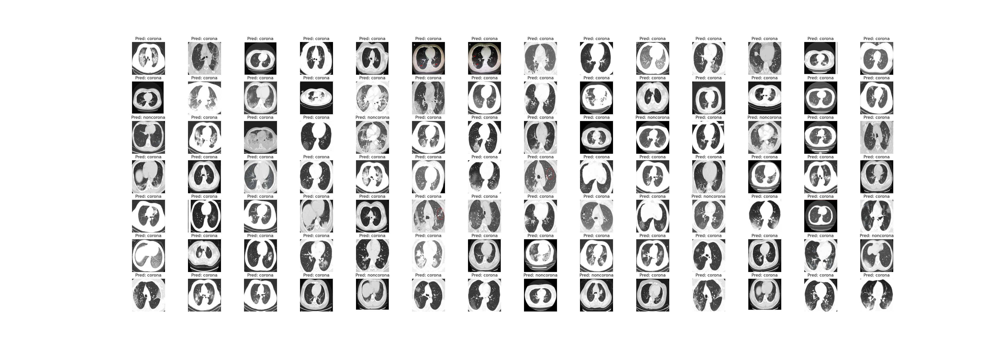
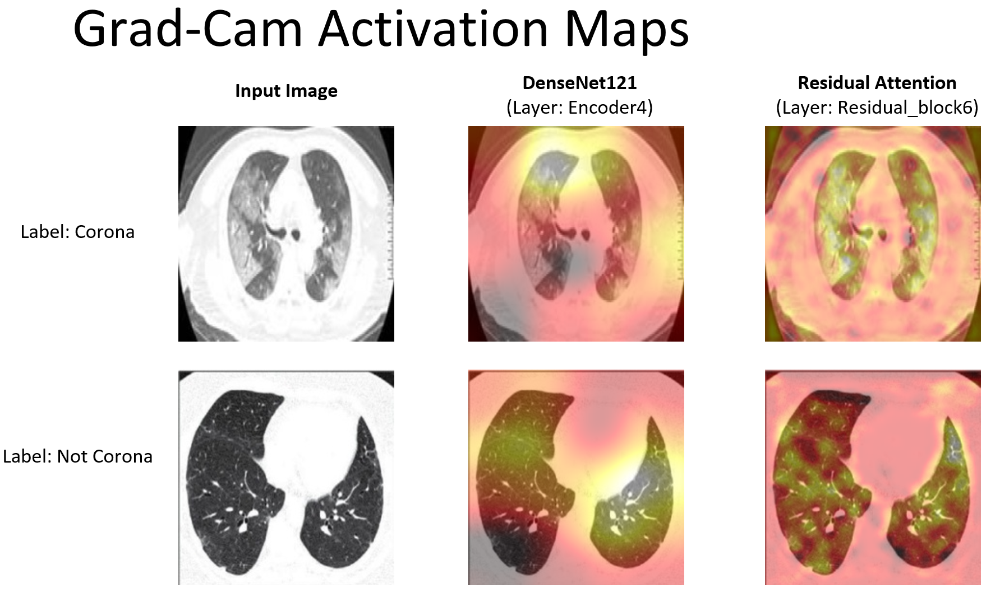

##  INFORMS 2020 QSR Data Challenge on "CT Scan Diagnosis for COVID-19"

The code of image classification on COVID dataset using pytorch on INFORMS 2020 QSR Data Challenge on COVID dataset. We use an ensemble model consisting Densenet 121 and Residual Attention model. We first split 15% of the data into validation which is not used in the training process. And we select the model which has the highest validation accuracy. Densenet 121 is pretrained on [ImageNet](http://www.image-net.org), and Residual Attention model is pretrained on [Cifar-10](https://www.cs.toronto.edu/~kriz/cifar.html). In training, we separately train these two pretrained models in an end-to-end manner. Then we extract features from the last 2nd layer, and perform another classifier on the learned concatenated features by these two models on the whole training dataset. Here we use SVM with random gaussian kernels. 


### Dependencies

* Python3, Scikit-learn, torch (Please refer to requirement.txt) 

### Dataset 

The data for this Data Challenge is selected from an open-source data set on COVID-19 CT images. The raw data have been divided into two subsets: training and test sets. The training dataset is provided to participants to develop their models. The training dataset consists of 251 COVID-19 and 292 non-COVID-19 CT images. In addition to the images, meta-information (e.g., patient information, severity, image caption) is provided in a spreadsheet. The details of
the original dataset can be found in [Zhao et al. (2020)](https://arxiv.org/pdf/2003.13865.pdf).

### How to run 

The training data is saved in data/training. If you want to use your own data, just replace everything in data/training. It contains two folders where one is COVID images, and another Non-Covid images. The test data should be put in data/test.

The performance might be a little different due to different performance of a certain seed on different devices.

```python
data_prep.py
```

to train DenseNet121 model: 
```python
python Model_densenet121.py
```

to train residual_attention model:
```python
python Model_residual_attention.py
```

to train the ensemble model:
```python
python Model_Ensemble.py
```

how to test?


### Training graphs


### Sample outputs

Sample classification results




### Evaluation

Here we **evaluate** the performance of our **best model** on the training data.

**Confusion Matrix**
```
[[247   4]
 [  2 290]]
```
**Accuracy**
```
Accuracy: 98.9%

```

### Versioning

Version 1.0

### Authors

Maede Maftouni, Andrew Chung Chee Law, Yangze Zhou, Bo Shen

### Acknowledgments
* "https://pytorch.org/tutorials/beginner/transfer_learning_tutorial.html"
* "https://pytorch.org/tutorials/beginner/finetuning_torchvision_models_tutorial.html"
* "https://www.learnopencv.com/image-classification-using-transfer-learning-in-pytorch/"
* "https://towardsdatascience.com/https-medium-com-dinber19-take-a-deeper-look-at-your-pytorch-model-with-the-new-tensorboard-built-in-513969cf6a72"
* "https://www.aiworkbox.com/lessons/how-to-define-a-convolutional-layer-in-pytorch#lesson-transcript-section"
* "https://medium.com/udacity-pytorch-challengers/ideas-on-how-to-fine-tune-a-pre-trained-model-in-pytorch-184c47185a20"
* "https://github.com/FrancescoSaverioZuppichini/Pytorch-how-and-when-to-use-Module-Sequential-ModuleList-and-ModuleDict"
* "https://www.kaggle.com/c/understanding_cloud_organization/discussion/112582"
* "https://stackoverflow.com/questions/53290306/confusion-matrix-and-test-accuracy-for-pytorch-transfer-learning-tutorial"
* "https://github.com/tengshaofeng/ResidualAttentionNetwork-pytorch"
* "https://github.com/UCSD-AI4H/COVID-CT"
* "https://arxiv.org/abs/2007.14846" 
* "https://arxiv.org/pdf/2003.13865.pdf"
